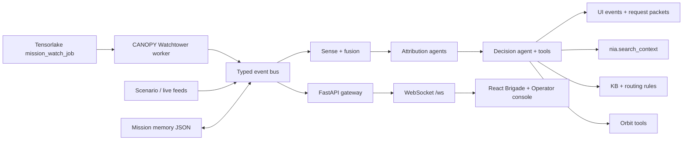

# coke-zero / CANOPY Watchtower

**An always-on mission watch agent for space-enabled tactical operations.**


coke-zero, presented as **CANOPY Watchtower**, is a background mission monitoring agent for brigade-level operators. It watches multi-domain operational signals, remembers prior alerts and operator decisions, retrieves grounded context, attributes threat activity, and escalates only when the risk picture meaningfully changes.

It is not just a dashboard. The important Track 1 proof is:

- it wakes up without a human clicking replay;
- it persists mission memory across runs;
- it behaves differently when the same pattern has been seen, dismissed, approved, or worsened before;
- it shows that background execution and memory are visible in the operator console.

## Links

- Deployed demo: [https://coke-zero-drab.vercel.app](https://coke-zero-drab.vercel.app)
- YouTube demo: [https://www.youtube.com/watch?v=NzDcP5XryC4](https://www.youtube.com/watch?v=NzDcP5XryC4)
- Demo health check: [https://coke-zero-drab.vercel.app/demo/health.json](https://coke-zero-drab.vercel.app/demo/health.json)
- Submission notes: [`SUBMISSION.md`](SUBMISSION.md)
- Tensorlake proof notes: [`docs/tensorlake_execution_proof.md`](docs/tensorlake_execution_proof.md)

The deployed Vercel demo can run from a checked-in static event feed when no public FastAPI gateway is configured. That keeps the judge path reliable without localhost access or secret credentials.

## Hackathon Story

For the Nozomio Hackathon, coke-zero is optimized for **Track 1: Always-On Agents**.

The 3-minute story:

> CANOPY Watchtower wakes up on a schedule, compares fresh mission signals against durable memory, retrieves Nia-grounded context, and alerts the operator only when SATCOM, PNT, cyber, RF/EW, orbit, or drone activity changes enough to require action.

The failure test is direct:

- remove background execution and the system stops watching;
- remove memory and it cannot tell repeated noise from a worsening campaign;
- remove Nia grounding and the reasoning loses fresh project/source context;
- remove Tensorlake/background execution proof and it becomes a local replay tool.

## Demo Path

Judge-facing path:

1. Open the deployed demo.
2. Wait for the autonomous static mission feed to replay.
3. Confirm the Brigade COP shows signals, map activity, event feed, reasoning traces, and a request-authority banner.
4. Open `/operator`.
5. Confirm the CANOPY Watchtower panel shows last autonomous run, memory count, decision basis, Tensorlake proof, and `nia.search_context`.
6. Review the anomaly queue, decision rail, action log, OSINT embedding panel, and reasoning trace.
7. Approve or deny the recommendation to show the operator decision loop and persistent memory path.

CLI demo path:

```powershell
uv run python scripts/watchtower.py `
  --scenario scenarios/army_multidomain_attack_chain.jsonl `
  --interval 20
```

One-cycle rehearsal:

```powershell
uv run python scripts/watchtower.py `
  --scenario scenarios/beat2.jsonl `
  --cycles 1 `
  --scenario-speed 1000 `
  --scenario-max-delay-s 0 `
  --drain-s 0.5
```

## What It Does

- Runs an autonomous mission-watch loop over scenario signals or live-feed refreshes.
- Persists mission memory in `data/mission_memory.json` or `COKE_ZERO_MEMORY_PATH`.
- Tracks seen signal IDs, prior alerts, operator approvals, denials, dismissals, risk baselines, context digests, and watch windows.
- Fuses RF/EW, cyber, PNT, SATCOM, orbit/SDA, drone, HUMINT, OSINT, and terrain signals into anomalies.
- Attributes threat activity through primary, red-team, and reconciler reasoning.
- Calls decision tools for KB lookup, orbit close approach, maneuver simulation, request drafting, route validation, and Nia context search.
- Produces commander-ready recommendations with request packets and authority routing.
- Streams every important step as typed events and terminal-style reasoning traces.
- Shows the result in two operator views: Brigade COP and Operator Console.
- Supports degraded-domain stress mode so operators can see confidence drop when PNT, SATCOM, or other lanes are blocked.

## Current Implementation

| Area | Status |
| --- | --- |
| Autonomous watch | `MissionWatchService`, API autostart controls, CLI `--watch`, and `scripts/watchtower.py` run mission cycles without UI clicks. |
| Durable memory | `MissionMemoryService` persists prior alerts, watch windows, operator actions, baselines, notes, and memory-aware trace lines. |
| Watchtower UI | Brigade and Operator views include a CANOPY Watchtower memory panel with last autonomous run, memory count, decision basis, sponsor proof, and risk baselines. |
| Sense/fusion | Scenario and ingest adapters normalize signals and correlate anomalies through a typed event bus. |
| Attribution | Primary attribution, red-team challenge, and reconciler stages produce actor/confidence reasoning. |
| Decision tools | `kb.lookup`, orbit tools, request drafting, routing validation, and `nia.search_context` are in the decision registry. |
| Nia grounding | Attribution/decision paths retrieve Nia context when available and fall back to local indexed files/KB. |
| Tensorlake proof | `coke_zero.tensorlake_app:mission_watch_job` and `scripts/tensorlake_mission_watch.py` capture background run evidence. |
| Frontend | React/Vite console with Brigade COP, Operator Console, Cesium/MapLibre visuals, static fallback feed, and live WebSocket mode. |
| Deployment | Vercel frontend with static demo health endpoint and optional public backend URLs. |

## Architecture

coke-zero is built around a typed in-process event bus. The FastAPI gateway exposes API routes and a WebSocket fanout; the frontend consumes the same event contract whether events come from live backend execution or the static deployed demo feed.



## Agent Pipeline

1. **Watch** - the background worker wakes on an interval, assigns a watch run id, and publishes scenario/source signals.
2. **Remember** - mission memory loads prior alerts, signal baselines, watch windows, and operator dispositions.
3. **Sense** - domain adapters normalize heterogeneous inputs into canonical `Signal` events.
4. **Fuse** - the fusion service groups related signals into cross-domain `Anomaly` clusters.
5. **Attribute** - primary, red-team, and reconciler agents produce calibrated attribution.
6. **Decide** - the decision agent calls tools, drafts a request packet, and routes authority.
7. **Trace** - every stage emits `ReasoningTrace` events so judges can see background, memory, Nia, tool, and decision logic.
8. **Operate** - the Operator Console lets a human approve, deny, or dismiss recommendations.
9. **Persist** - memory records what happened so the next run can say why the pattern is repeated, new, or worse.

## Watchtower Memory

Default memory path:

```text
data/mission_memory.json
```

The durable store tracks fields like:

```json
{
  "theater": "CENTCOM / Iraq",
  "last_run_at": "2026-05-09T22:56:43Z",
  "seen_signal_ids": [],
  "dismissed_patterns": [],
  "approved_actions": [],
  "risk_baselines": {
    "satcom": 0.42,
    "pnt": 0.35,
    "orbit": 0.51
  },
  "operator_notes": []
}
```

Representative trace lines:

```text
[watchtower] woke up on schedule
[memory] 4 prior SATCOM alerts found
[memory] previous operator denied passive alert
[tools] nia.search_context -> 3 relevant doctrine/source notes
[decision] escalated because SATCOM + PNT + orbit changed since last run
```

Reset memory for a clean demo:

```powershell
uv run python scripts/watchtower.py --once --reset-memory
```

or against a running gateway:

```bash
curl -X POST http://localhost:8000/memory/reset
```

## Sponsor Integrations

| Sponsor / tool | coke-zero role |
| --- | --- |
| Nia | Fresh context layer for repo docs, KB entries, source notes, scenarios, and code. Visible through `nia.context` and `nia.search_context` trace lines. |
| Tensorlake | Always-on/background execution proof through `coke_zero.tensorlake_app:mission_watch_job` and the local worker-shim artifact path. |
| Vercel | Public judge-facing deployment for the React console and static event feed. |
| OpenAI | Optional API/model support for sponsor demos or fallback experiments. The core engine can run via stub, Anthropic, or Ollama. |
| Hyperspell | Optional organization-memory layer for operator notes, approved actions, watch summaries, and source digests. |
| InsForge / Convex | Optional production shell and realtime state path if the project pivots into a full-stack authenticated control plane. |
| GitHub | Optional repo or PR-review context demos; not required for the primary mission-watch path. |

## Data Sources

| Source | Domain | Role |
| --- | --- | --- |
| `scenarios/*.jsonl` | multi-domain | Deterministic mission beats for demo and verification. |
| `bench/scenarios/` | synthetic variants | Perturbed benchmark scenarios for latency and accuracy scoring. |
| `kb/` and `data/kb_seed_entries.json` | tradecraft | Actor capabilities, doctrine references, and routing rules for `kb.lookup`. |
| CelesTrak GP catalog | orbit / SDA | TLE/OMM feeds for orbital propagation and close-approach geometry. |
| N2YO position feed | orbit / SDA | Per-satellite position cache for orbital tracks in the Cesium globe. |
| OSINT corpus | open source | Sentence-transformer embeddings, clustering, and 2D projection for the embedding panel. |
| `nia.json` | context | Optional Nia project binding over docs, code, scenarios, KB, and source notes. |

Every source, live or fixture, enters the same canonical `Signal` schema.

## Local Development

Requirements:

- Python 3.12 or newer with `uv`.
- Node.js compatible with Vite 8.
- npm.
- Optional Ollama, Anthropic, Nia, Tensorlake, and N2YO credentials depending on which path you run.

Install Python dependencies:

```bash
uv sync
```

Install frontend dependencies:

```bash
npm install
```

Start the backend gateway:

```bash
uv run uvicorn coke_zero.api:app --host 0.0.0.0 --port 8000
```

Start the frontend:

```bash
npm run dev
```

Open:

```text
http://localhost:5173
```

Operator route:

```text
http://localhost:5173/operator
```

If the gateway is on a different host, set:

```bash
VITE_COKE_ZERO_API_URL=http://127.0.0.1:8000
VITE_COKE_ZERO_WS_URL=ws://127.0.0.1:8000/ws
```

## Always-On Modes

API autostart mode:

```powershell
$env:COKE_ZERO_WATCH_AUTOSTART="1"
$env:COKE_ZERO_WATCH_SCENARIOS="army_multidomain_attack_chain.jsonl"
$env:COKE_ZERO_WATCH_INTERVAL_S="60"
$env:COKE_ZERO_WATCH_SPEED="200"
$env:COKE_ZERO_WATCH_MAX_DELAY_S="0.05"
uv run uvicorn coke_zero.api:app --host 0.0.0.0 --port 8000
```

Standalone Watchtower:

```powershell
uv run python scripts/watchtower.py `
  --scenario scenarios/army_multidomain_attack_chain.jsonl `
  --interval 20
```

Package CLI:

```bash
uv run python -m coke_zero --watch --watch-cycles 1 --scenario scenarios/army_multidomain_attack_chain.jsonl
```

Tensorlake local-shim proof:

```powershell
uv run python scripts/tensorlake_mission_watch.py `
  --local-shim `
  --ignore-dotenv `
  --scenario scenarios/army_multidomain_attack_chain.jsonl `
  --scenario-speed 200 `
  --scenario-max-delay-s 0.05 `
  --drain-s 4
```

Evidence writes to:

```text
dist/tensorlake/<run_id>/events.jsonl
dist/tensorlake/<run_id>/summary.json
```

## API Surface

The FastAPI gateway exposes:

| Endpoint | Purpose |
| --- | --- |
| `GET /kb` | Inspect KB entries. |
| `GET /scenarios` | List replayable scenarios. |
| `POST /scenarios/{id}/replay` | Replay a scenario into the event bus. |
| `GET /watch` | Inspect mission-watch status. |
| `POST /watch/start` | Start the background watch service. |
| `POST /watch/run-once` | Run one autonomous watch cycle. |
| `GET /memory` | Inspect durable mission memory. |
| `POST /memory/operator-action` | Persist approve, deny, or dismiss actions. |
| `POST /memory/reset` | Reset memory for demo rehearsal. |
| `POST /stress` | Simulate degraded domains such as PNT or SATCOM loss. |
| `WS /ws` | Stream signals, anomalies, attribution, decisions, UI events, and reasoning traces. |

## Environment

Copy `.env.example` to `.env` or `.env.local` for live integrations.

| Variable | Purpose |
| --- | --- |
| `COKE_ZERO_LLM` | Select `stub`, `anthropic`, or `ollama`. |
| `ANTHROPIC_API_KEY` | Required only for Anthropic live mode. |
| `COKE_ZERO_OLLAMA_URL` | Ollama daemon URL for local inference. |
| `COKE_ZERO_OLLAMA_MODEL` | Ollama model tag. |
| `COKE_ZERO_MEMORY_PATH` | Durable mission memory path. |
| `NIA_API_KEY` | Optional Nia auth when env-based auth is used. |
| `COKE_ZERO_NIA_ENABLED` | Enables or disables Nia retrieval. |
| `NIA_CLI` | Nia command, defaulting to `npx -y @nozomioai/nia`. |
| `TENSORLAKE_API_KEY` | Enables Tensorlake cloud execution. |
| `N2YO_API_KEY` | Enables live N2YO orbital cache refresh. |
| `VITE_COKE_ZERO_API_URL` | Dev frontend HTTP API URL. |
| `VITE_COKE_ZERO_WS_URL` | Dev frontend WebSocket URL. |
| `VITE_COKE_ZERO_PUBLIC_API_URL` | Public deployment API URL. |
| `VITE_COKE_ZERO_PUBLIC_WS_URL` | Public deployment WebSocket URL. |
| `HYPERSPELL_API_KEY` | Optional organization-memory integration. |
| `OPENAI_API_KEY` | Optional sponsor/API support. |
| `INSFORGE_API_KEY` | Optional production shell path. |
| `CONVEX_ACCESS_TOKEN` | Optional full-stack state backend path. |

## Verification

Run the focused Watchtower/memory suites:

```bash
uv run pytest tests/test_mission_memory.py tests/test_mission_watch.py tests/test_decision_tools.py tests/test_nia_context.py
```

Run the full Python suite:

```bash
uv run pytest
```

Run frontend build:

```bash
npm run build
```

One-shot engine verification:

```bash
uv run python scripts/verify.py scenarios/army_multidomain_attack_chain.jsonl
```

Benchmark harness:

```bash
uv run python -m bench.run
```

## Project Map

| Path | What it contains |
| --- | --- |
| `coke_zero/` | Python engine, FastAPI gateway, services, schemas, memory, mission watch, Nia, Tensorlake, and tools. |
| `scripts/watchtower.py` | Standalone always-on Watchtower worker. |
| `scripts/tensorlake_mission_watch.py` | Tensorlake-compatible background execution proof and local shim. |
| `src/` | React/Vite UI for Brigade COP, Operator Console, Watchtower panel, traces, maps, and embeddings. |
| `scenarios/` | Hand-authored mission JSONL beats. |
| `bench/` | Scenario variants and benchmark runner. |
| `kb/` | Capability and routing knowledge base. |
| `data/` | KB seeds, memory file, orbital cache metadata, and source registry. |
| `public/orbital/` | N2YO/CelesTrak-derived orbital fixtures for frontend visualization. |
| `docs/` | Architecture, handoff, and Tensorlake proof notes. |
| `SUBMISSION.md` | Final hackathon submission story and limitations. |

## Safety Model

coke-zero is defensive decision support:

- no recommendation is presented as an automatic kinetic action;
- request-authority packets keep a human operator in the loop;
- memory records approvals and denials so repeated recommendations can be contextualized;
- sensitive runtime secrets stay in local environment files;
- the deployed judge demo uses fixtures unless a public backend is explicitly configured;
- live external APIs are optional so degraded connectivity does not break the demo.

## Known Limits

- The deployed Vercel demo uses static fixture replay unless public backend URLs are configured.
- Tensorlake cloud execution requires `TENSORLAKE_API_KEY`; local-shim proof is included.
- Nia live search depends on local auth/quota; local `nia.json` fallback and KB fallback keep the engine running.
- Live CelesTrak/N2YO refreshes are optional; checked-in orbital fixtures keep the demo reliable.
- The engine is decision support, not autonomous engagement.

## Positioning

coke-zero is the mission-operations layer around sensing, attribution, memory, and operator decision support.

General dashboards show live state. CANOPY Watchtower watches while the operator is away, remembers what happened before, and explains why this run is repeated noise or a changed threat picture.
